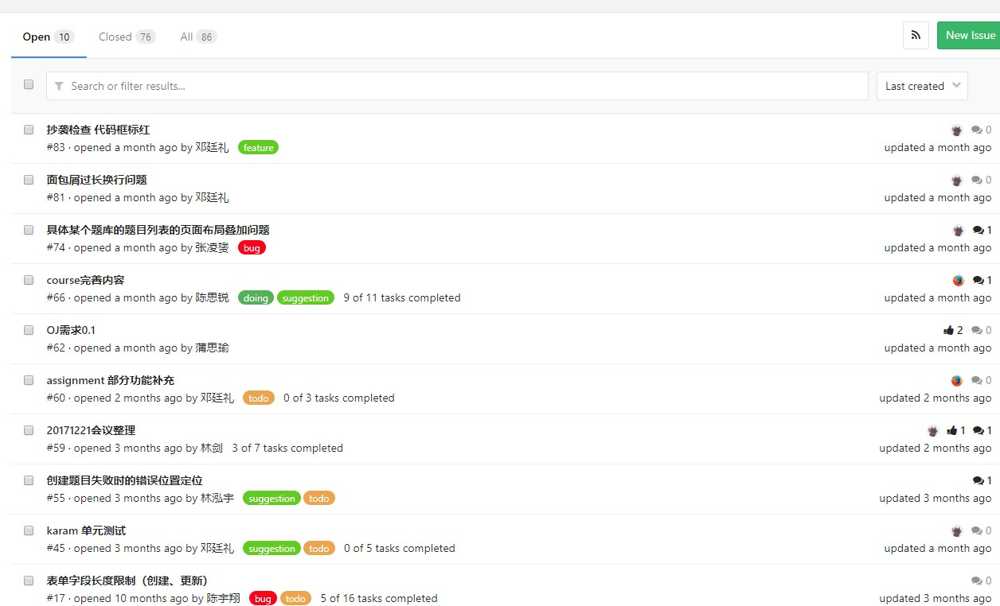

> 人，软件工程项目中最重要、也是最活跃的的资源。软件项目管理的一个重要方面的人力资源的组织、分配、以及绩效的评价。在 CMM 中，CMU 的专家们针对软件工程师也有一套模型: 叫 Personal Software Process (PSP), 对软件团队则有 Team Software Process（TSP）。

<!-- more -->

## 1、简答题

### 简述瀑布模型、增量模型、螺旋模型（含原型方法）的优缺点。

#### 瀑布模型

- 优点：强调系统开发过程需有完整的规划、分析、设计、测试及文件等管理与控制，因此能有效的确保系统品质。由于存在阶段性，各个阶段可以方便的总结归纳，便于迭代

- 缺点：因为过程很少能够以连续由上而下的方式进行。经常会需要回到前面的阶段，或改变前一阶段的结果。

#### 增量模型

- 优点：开发过程从核心到细节，每次增量交付过程中获取的经验，有利于后面的改进，客户也有机会对建立好的模型作出反应。

- 缺点：若软件可拆卸度不高，开发人员全局把握水平不高，用户不同意分阶段提交产品，或者开发人员过剩，都不适宜使用增量模型

#### 螺旋模型

- 优点：通过原型的创建，使软件开发在每个迭代的最初明确方向。通过风险分析，最大程度地降低软件彻底失败造成损失的可能性。在每个迭代阶段植入软件测试，使每个阶段的质量得到保证。整体过程具备很高的灵活性，在开发过程的任何阶段自由应对变化。每个迭代阶段累计开发成本，使支出状况容易掌握。通过对用户反馈的采集，与用户沟通，以保证用户需求的最大实现。

- 缺点：过分依赖风险分析经验与技术，一旦在风险分析过程中出现偏差将造成重大损失。过于灵活的开发过程不利于已经签署合同的客户与开发者之间的协调。

### 简述 UP 的三大特点，其中哪些内容体现了用户驱动的开发，哪些内容体现风险驱动的开发？

- 三大特点：（1）用例驱动（2）以体系结构为核心（3）迭代及增量

- 体现了用户驱动的开发：用例驱动

- 体现了风险驱动的开发：以体系结构为核心

### UP 四个阶段的划分准则是什么？关键的里程碑是什么？

划分准则：

- 初始阶段：包括用户沟通和计划活动两个方面，强调定义和细化用例，并将其作为主要模型。
- 细化阶段：包括用户沟通和建模活动，重点是创建分析和设计模型，强调类的定义和体系结构的表示。
- 构造阶段：将设计转化为实现，并进行集成和测试。
- 移交阶段：将产品发布给用户进行测试评价，并收集用户的意见，之后再次进行迭代修改产品使之完善。

关键的里程碑：在阶段结尾执行一次评估以确定这个阶段的目标是否已经满足。

### IT 项目管理中，“工期、质量、范围/内容” 三个元素中，在合同固定条件下，为什么说“范围/内容”是项目团队是易于控制的

前两者都是受到合同、客户要求确定的，而范围和内容则是围绕项目团队本身展开。

### 为什么说，UP 为企业按固定节奏生产、固定周期发布软件产品提供了依据？

因为每一个阶段可以分解为团队中的一次迭代，为团队中开发进度提供了很好的依据，也非常方便团队进行软件产品的评估。

## 2、项目管理使用

### 使用截图工具（png格式输出），展现你团队的任务

