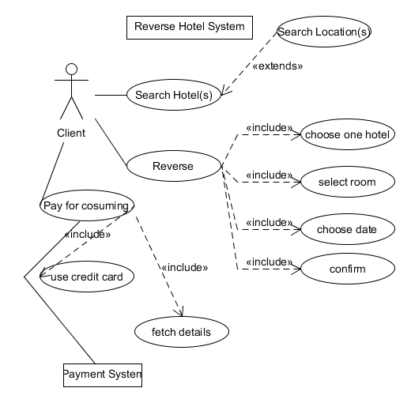
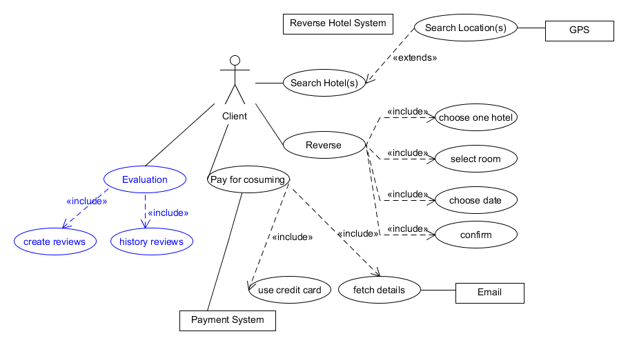
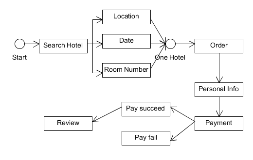
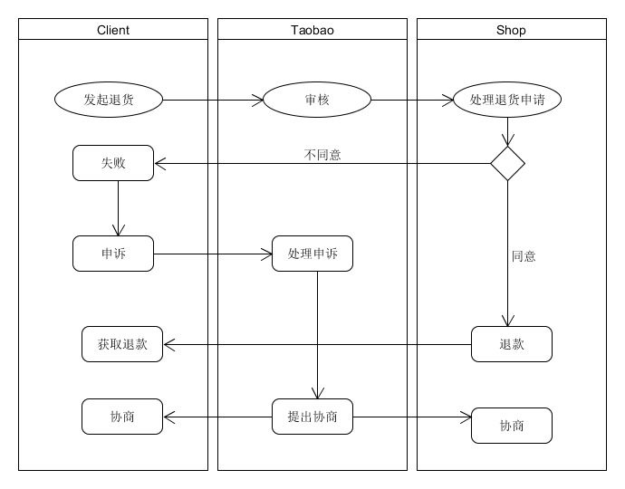

## 用例建模

> 阅读 Asg_RH 文档，绘制用例图。 按 Task1 要求，请使用工具 UMLet，截图格式务必是 png 并控制尺寸

> 选择你熟悉的定旅馆在线服务系统（或移动 APP），如绘制用例图。

例如某个旅馆系统通常还有评价系统，主要包括历史的房客对旅馆的评价，同时客户也能给予相应评价。

> 对比两个时代、不同地区产品的用例图，总结在项目早期，发现创新的思路与方法。

项目早期的时候应该尽量可能地使用在当时环境下先进的技术，例如`GPS`等。这样可以尽早为后续新功能的添加奠定“可维护性”强的基础。通常后者的用例图中，用户可以使用的功能更加细致繁多。

> 请使用 SCRUM 方法，在（任务b）用例图基础上，编制某定旅馆开发的需求

| 功能 | 优先级 | 需求 |
| - | - | - |
| 旅馆搜索 | B | 可以查看附近、或搜索相应的旅馆酒店 |
| 旅馆信息 | A | 查看旅馆详情，包括房间情况、地理位置等等 |
| 选择入住 | A | 选择入住时间、入住房号等 |
| 提交订单 | A | 选择支付方式，利用第三方支付平台，支付订单 |
| 评价反馈 | C | 查看历史评价，给予相应评价 |

## 业务建模

> 在（任务b）基础上，用活动图建模找酒店用例。简述利用流程图发现子用例的方法

> 查找淘宝退货业务官方文档，使用多泳道图，表达客户、淘宝网、淘宝商家服务系统、商家等用户和系统协同完成退货业务的过程。分析客户要完成退货业务，在淘宝网上需要实现哪些系统用例

## 用例文本编写

> 在大作业基础上，分析三种用例文本的优点和缺点

- 摘要：简单但是缺少细节
- 非正式用例：较详细但不正式
- 详述用例：详细细致，但实现成本较高